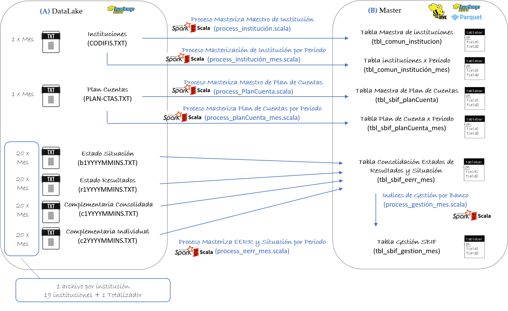

# Estructura del Proyecto

La estructura una solución utilizado Huemul BigDataGovernance es muy similar al desarrollo de proyectos de Almacenes de Datos, el objetivo es que la adaptación para analistas expertos en ambientes tradicionales sea lo más rápida posible. En la siguiente imagen se muestra un ejemplo de la estructura de un proyecto tipo.

Si bien es cierto puedes utilizar la estructura que más te acomode, recomendamos usar este layout. La explicación de cada elemento se detalla a continuación.

## Packages
Los packages son una forma de ordenar el código en tu solución, es el path que en forma posterior se utilizará para la ejecución de los procesos en Spark. La estructura es la siguiente:

* **com.yourcompany.yourapplication**: Se utiliza para guardar los códigos de lógica de negocio. En ambientes de Base de Datos tradicionales sería el equivalente a los procedimientos almacenados.
* **com.yourcompany.yourapplication.datalake**: Se utiliza para definir la estructura de las interfaces de entrada. En ambientes de DataWarehouse tradicionales sería el equivalente a definir un archivo de formato y el proceso bulk insert (FMT + bulk en SQL Server)
* **com.yourcompany.tables.master**: Se utiliza para almacenar las definiciones de las tablas. En ambientes de Bases de Datos tradicionales sería el equivalente de las tablas.

La estructura de package descrita anteriomente aplica para proyectos de masterización. La única diferencia con la generación de modelos analíticos, de reportes o dimensionales, es que debes agregar los packages corresponidentes a dichos ambientes:

* com.yourcompany.tables.dimensional: Tablas del ambiente Dimensional.
* com.yourcompany.tables.analytics: Tablas del ambiente Analítico.
* com.yourcompany.tables.reporting: Tablas del ambiente de reporting.
* com.yourcompany.tables.dimensional: Tablas del ambiente Dimensional.
* com.yourcompany.tables.sandbox: Tablas del ambiente SandBox de usuarios.

## Nomenclatura de Objetos
Para mantener el orden del proyecto y la fácil comprensión de cualquier integrante del equipo, sugerimos usar la siguiente nomenclatura en la creación de los objetos:

* **Tablas**: tbl_[[yourapplication]]_[[entidad]]_[[per]]: tbl es el prefijo de cualquier tabla, [[yourapplication]] es la identificación del proyecto o sistema que estás trabajando, [[entidad]] es el nombre de la interfaz puntual que estás almacenando, y [[per]] es la periodicidad de los datos (mensual, diaria, semana, etc).
* **interfaces**: raw_[[entidad_o_nombre]]: raw es el prefijo de cualquier definición de interfaz, [[entidad_o_nombre]] es el nombre específico de la interfaz. 
* **Lógicas de Negocio**: process_[[entidad]]_[[per]]: process es el prefijo de cualquier lógica de negocio, [[entidad]] es el nombre del proyecto o sistema que se está procesando, y [[per]] es la periodicidad de los datos (mensual, diaria, semana, etc).

## Entendiendo el proyecto en Scala
Ya vimos la estructura del proyecto, los package y la nomenclatura, ahora explicaremos algunos elementos adicionales del proyecto.

### src/main/scala
En esta sección se encuentra todo el código que será ejecutado en el servidor, toda la estructura explicada anteriormente reside en eseta sección.

### src/test/scala
En esta sección se puede incluir el código de plan de pruebas. Este código de pruebas será ejecutado en forma automática antes de instalar el proyecto en producción.

En esta sección hemos incluido una clase que permite generar en forma automática el código de la definición de tablas y del procesamiento de la misma, en la sección de template podrás encontrar el código ejemplo.

### pom.xml
El [pom](https://maven.apache.org/pom.html) (Project Object Model) es un archivo de configuración utilizado por [Maven](https://maven.apache.org/) para descargar en forma automática todas las librerías que serán utilizadas por tu solución, también se configura la forma de instalar y hacer deploy de tu solución. El código de ejemplo lo puedes encontrar en la sección de template.

## Entendiendo el flujo de los datos
Te recomendamos que antes de comenzar a codificar, hagas un diseño de las tablas que crearás a partir de tus interfaces de entrada, esto te permitirá avanzar de forma más organizada en el desarrollo de tu proyecto. La siguiente imagen muestra un ejemplo del diseño de nuestro proyecto de ejemplo.

