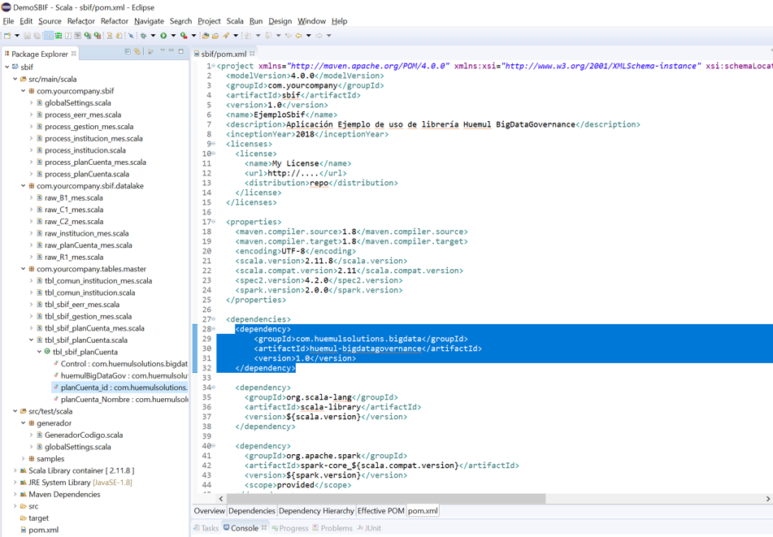

# Estructura del Proyecto

La estructura una solución utilizado Huemul BigDataGovernance es muy similar al desarrollo de proyectos de Almacenes de Datos, el objetivo es que la adaptación para analistas expertos en ambientes tradicionales sea lo más rápida posible. En la siguiente imagen se muestra un ejemplo de la estructura de un proyecto tipo.



Si bien es cierto puedes utilizar la estructura que más te acomode, recomendamos usar este layout. La explicación de cada elemento se detalla a continuación.

## Packages:
Los packages son una forma de ordenar el código en tu solución, es el path que en forma posterior se utilizará para la ejecución de los procesos en Spark. La estructura es la siguiente:

* **com.yourcompany.yourapplication**: Se utiliza para guardar los códigos de lógica de negocio. En ambientes de Base de Datos tradicionales sería el equivalente a los procedimientos almacenados.
* **com.yourcompany.yourapplication.datalake**: Se utiliza para definir la estructura de las interfaces de entrada. En ambientes de DataWarehouse tradicionales sería el equivalente a definir un archivo de formato y el proceso bulk insert (FMT + bulk en SQL Server)
* **com.yourcompany.tables.master**: Se utiliza para almacenar las definiciones de las tablas. En ambientes de Bases de Datos tradicionales sería el equivalente de las tablas.

La estructura de package descrita anteriomente aplica para proyectos de masterización. La única diferencia con la generación de modelos analíticos, de reportes o dimensionales, es que debes agregar los packages corresponidentes a dichos ambientes:

* com.yourcompany.tables.dimensional: Tablas del ambiente Dimensional.
* com.yourcompany.tables.analytics: Tablas del ambiente Analítico.
* com.yourcompany.tables.reporting: Tablas del ambiente de reporting.
* com.yourcompany.tables.dimensional: Tablas del ambiente Dimensional.
* com.yourcompany.tables.sandbox: Tablas del ambiente SandBox de usuarios.

## Nomenclatura de Objetos:
Para mantener el orden del proyecto y la fácil comprensión de cualquier integrante del equipo, sugerimos usar la siguiente nomenclatura en la creación de los objetos:

* **Tablas**: tbl_[[yourapplication]]_[[entidad]]_[[per]]: tbl es el prefijo de cualquier tabla, [[yourapplication]] es la identificación del proyecto o sistema que estás trabajando, [[entidad]] es el nombre de la interfaz puntual que estás almacenando, y [[per]] es la periodicidad de los datos (mensual, diaria, semana, etc).
* **interfaces**: raw_[[entidad_o_nombre]]: raw es el prefijo de cualquier definición de interfaz, [[entidad_o_nombre]] es el nombre específico de la interfaz. 
* **Lógicas de Negocio**: process_[[entidad]]_[[per]]: process es el prefijo de cualquier lógica de negocio, [[entidad]] es el nombre del proyecto o sistema que se está procesando, y [[per]] es la periodicidad de los datos (mensual, diaria, semana, etc).


```scala
  class tbl_pais(HuemulLib: huemul_Library, Control: huemul_Control) extends huemul_Table(HuemulLib,Control) with     Serializable {
    this.setDescription("Tabla que contiene los datos de países para el ambiente analítico")
    
    this.setTableType(huemulType_Tables.Master)
    this.setDataBase(HuemulLib.GlobalSettings.MASTER_DataBase)
    
    this.setGlobalPaths(HuemulLib.GlobalSettings.MASTER_BigFiles_Path)
    this.setLocalPath("planPruebas/")
    this.setStorageType(huemulType_StorageType.PARQUET)
    this.setDQ_MaxNewRecords_Num(4)

    val pais_id = new huemul_Columns(StringType,true,"Codigo internacional del país. Ejemplo: chile codigo 056")
    pais_id.IsPK = true
    pais_id.DQ_MinLen = 3
    pais_id.DQ_MaxLen = 3

    val pais_nombre = new huemul_Columns(StringType,true,"Nombre del país. Ejemplo: chile")
    pais_nombre.Nullable = false
  
    this.ApplyTableDefinition()
  
  }
  ```

## Agrega identificación de responsables
> Puedes especificar en el mismo código quiénes son los responsables de TI y de negocio, estos datos son almacenados en el catálogo de la aplicación

```scala
  class tbl_pais(HuemulLib: huemul_Library, Control: huemul_Control) extends huemul_Table(HuemulLib,Control) with     Serializable {
    this.setDescription("Tabla que contiene los datos de países para el ambiente analítico")
    
    ...
  ```


## Calidad de Datos en una sola línea

> Incluir reglas de validación nunca fue tan sencillo!. En una sola línea puedes especificar reglas predefinidas, como validación de largos, valores máximos, mínimos y validación de nulos. También puedes agregar validaciones de integridad de datos entre tablas. Las reglas más complejas también las puedes definir en una sola línea.
>Todas estas validaciones quedan almacenadas en el catálogo del sistema, en forma posterior puedes consultar el resultado de la ejecución.

```scala
  class tbl_pais(HuemulLib: huemul_Library, Control: huemul_Control) extends huemul_Table(HuemulLib,Control) with     Serializable {
    this.setDescription("Tabla que contiene los datos de países para el ambiente analítico")
    
    ...
  ```


### DQ: Reglas de Validez de datos

> Asegurar que los datos se estén cargando con las especificaciones correctas es fundamental para el uso de esta información, aplicar estas reglas est muy sencillo, solo debes agregar una línea de código!.

```scala
//Define campo pais_id
val pais_id = new huemul_Columns(StringType,true,"Codigo internacional del país. Ejemplo: chile codigo 056")
    //Largo del campo debe ser siempre 3, por tanto definimos largo máximo y mínimo como 3
    pais_id.DQ_MinLen = 3
    pais_id.DQ_MaxLen = 3
    
    //Además, definimos que el campo no puede tener valores nulos
    pais_id.Nullable = false
```
> Listo!, con 3 simples líneas de código estamos asegurando la validez de nuestros datos.

### DQ: Integridad de Datos y Valores Únicos

> Puedes especificar que los valores en tu tabla sean únicos, ya sea identificando una Primary Key, o indicando en cada campo si el valor es único o no.

```scala
//Define campo pais_id
val pais_id = new huemul_Columns(StringType,true,"Codigo internacional del país. Ejemplo: chile codigo 056")
    //el campo pais_id es la clave primaria de la tabla tbl_pais.
    pais_id.IsPK = true
    
val pais_nombre = new huemul_Columns(StringType,true,"Nombre del país. Ejemplo: chile")
    //adicionalmente, podemos identificar el campo pais_nombre como único, es decir, no se pueden repetir los valores en la tabla
    pais_nombre.IsUnique = true
   
```

> Listo!, integridad de datos aplicada.


## Tracking de cambios de datos en tablas maestras

> Siempre es complejo agregar control de cambios a las tablas, por eso hemos incluido funciones especiales para hacer esta tarea algo sencillo.
>En las tablas maestras, puedes marcar en cada atributo qué tipo de tracking quieres hacer, puedes guardar el valor anterior, la última fecha de cambio y el proceso que hizo ese cambio
> Esto es equivalente a implementar el SCD tipo 2 de kimball.

```scala
  val pais_nombre = new huemul_Columns(StringType,true,"Nombre del país. Ejemplo: chile")
    //En caso de tener modificaciones, creará en forma automática un campo llamado "pais_nombre_old" con el valor anterior
    pais_nombre.MDM_EnableOldValue = true
    //En caso de tener cambios, guardará la fecha/hora de modificación en el campo "pais_nombre_fhChange"
    pais_nombre.MDM_EnableDTLog = true
    //En caso de tener cambios, guardará el proceso que hizo el cambio en el campo "pais_nombre_ProcessLog"
    pais_nombre.MDM_EnableProcessLog = true
    
    ...
  ```


##### Header 5

1.  This is an ordered list following a header.
2.  This is an ordered list following a header.
3.  This is an ordered list following a header.

###### Header 6

| head1        | head two          | three |
|:-------------|:------------------|:------|
| ok           | good swedish fish | nice  |
| out of stock | good and plenty   | nice  |
| ok           | good `oreos`      | hmm   |
| ok           | good `zoute` drop | yumm  |

### There's a horizontal rule below this.

* * *

### Here is an unordered list:

*   Item foo
*   Item bar
*   Item baz
*   Item zip

### And an ordered list:

1.  Item one
1.  Item two
1.  Item three
1.  Item four

### And a nested list:

- level 1 item
  - level 2 item
  - level 2 item
    - level 3 item
    - level 3 item
- level 1 item
  - level 2 item
  - level 2 item
  - level 2 item
- level 1 item
  - level 2 item
  - level 2 item
- level 1 item

### Small image


### Large image


### Definition lists can be used with HTML syntax.

<dl>
<dt>Name</dt>
<dd>Godzilla</dd>
<dt>Born</dt>
<dd>1952</dd>
<dt>Birthplace</dt>
<dd>Japan</dd>
<dt>Color</dt>
<dd>Green</dd>
</dl>

```
Long, single-line code blocks should not wrap. They should horizontally scroll if they are too long. This line should be long enough to demonstrate this.
```

```
The final element.
```
