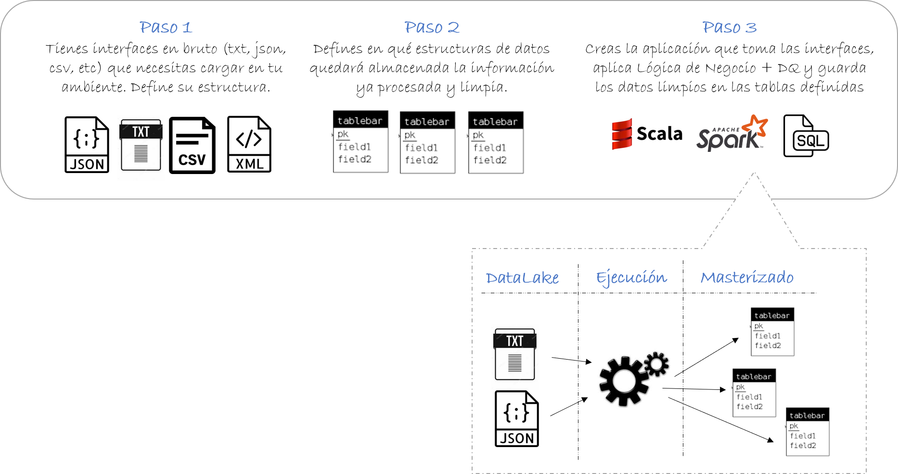
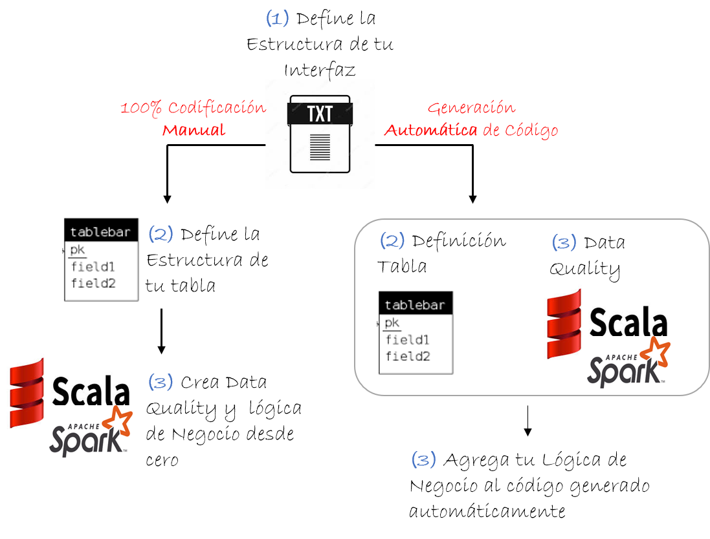

**Huemul BigDataGovernance**, es una librería que trabaja sobre Spark, Hive y HDFS que permite la implementación de una **estrategia corporativa de dato único**, basada en buenas prácticas de Gobierno de Datos.

### ¿Cómo Funciona?
El diseño de Huemul BigDataGovernance está pensado en optimizar el tiempo de desarrollo de los analistas de datos. Utilizando una metodología sólida permitimos que los ingenieros de tu equipo centren sus esfuerzos en la definición de las interfaces de entrada, la definición de las tablas masterizadas y la construcción de los procesos de masterización robustos.



Hay dos formas de generar el código de cada paso:

1.  La primera forma es generar el código desde cero utilizando los [template que están disponibles acá](template_codigo).
2.  En la segunda forma solo debes crear la definición de tu interfaz de entrada utilizando este [template sencillo](template_codigo), y luego puedes generar el código de tu tabla y el código de masterización en forma automática!. En el código de la tabla se implementa en forma automática validaciones de calidad de datos, y te permite agregar fácilmente otras validaciones más complejas.



### Acelera los desarrollos en 5X y mejora la calidad de datos!
¿Sabías que, en promedio, deberías aplicar como mínimo 3 reglas de calidad de datos por cada columna?, es decir, en una tabla con 10 columnas deberías programar más de 30 reglas de validación (son más de 300 líneas de código si programas cada regla en 10 líneas). y esto es solo para asegurar la validez de tus datos, sin contar reglas de integridad, completitud y precisión.... **y aún no has aplicado ninguna regla de transformación de negocio**

Con Huemul BigDataGovernance, esas 300 líneas de código se reducen a 30 (1 línea por cada validación)... y además te entrega de forma automática documentación de tu proyecto.

### Simplicidad y Eficiencia
Huemul BigDataGovernance permite reducir en forma importante el tiempo de desarrollo de tus proyectos BigData, aumentando la calidad de los datos, **en el mismo código se definen las estructuras de datos, se crea automáticamente el diccionarios de datos, trazabilidad de la información, reglas de data quality, planes de pruebas y criterios de negocio, TODO AL MISMO TIEMPO!** 

Toda la **documentación del proyecto siempre estará actualizada**, cada vez que se ejecuta el código en producción se actualizan los diccionarios y respositorios de trazabilidad, nunca más tendrás que preocuparte por actualizar manualmente la documentación.


### Modelo de Operación Basado en Buenas Prácticas de Gobierno de Datos
La implementación de todas estas etapas puede tardar más de una semana, con Huemul BigDataGovernance lo puedes hacer en unas pocas horas. 


Debido al tiempo que demora implementar todas estas estapas, en la práctica solo se logra trabajar en la lógica de negocio sin DataQuality, los planes de pruebas y documentación de los procesos nunca se complentan adecuadamente, esto poniendo en riesgo el éxito de las soluciones analíticas.

La construcción de Huemul BigDataGovernance está basada en las buenas prácticas descritas en el DAMA-DMBOK2 ([Data Management Body Of Knowledge](www.dama.org)), y permite agilizar el desarrollo de proyectos de BigData a nivel corporativo.


¿Maravilloso no?, **[¿y como se hace?](pasos_desarrollo)**


# Define las tablas como si fueran clases!

La estructura de las tablas las defines como una clase en Scala, de esta forma es super fácil para cualquier miembro del equipo conocer los tipos de datos, descripción de campos y revisión de reglas de DataQuality.
Las rutas de almacenamiento en HDFS dentro del servidor se definen en un fichero de configuración, es super simple!.

  ```scala
  class tbl_pais(HuemulLib: huemul_Library, Control: huemul_Control) extends huemul_Table(HuemulLib,Control) with     Serializable {
    this.setDescription("Tabla que contiene los datos de países para el ambiente analítico")
    
    this.setTableType(huemulType_Tables.Master)
    this.setDataBase(HuemulLib.GlobalSettings.MASTER_DataBase)
    
    this.setGlobalPaths(HuemulLib.GlobalSettings.MASTER_BigFiles_Path)
    this.setLocalPath("planPruebas/")
    this.setStorageType(huemulType_StorageType.PARQUET)
    this.setDQ_MaxNewRecords_Num(4)

    val pais_id = new huemul_Columns(StringType,true,"Codigo internacional del país. Ejemplo: chile codigo 056")
    pais_id.IsPK = true
    pais_id.DQ_MinLen = 3
    pais_id.DQ_MaxLen = 3

    val pais_nombre = new huemul_Columns(StringType,true,"Nombre del país. Ejemplo: chile")
    pais_nombre.Nullable = false
  
    this.ApplyTableDefinition()
  
  }
  ```

## Agrega identificación de responsables
> Puedes especificar en el mismo código quiénes son los responsables de TI y de negocio, estos datos son almacenados en el catálogo de la aplicación

```scala
  class tbl_pais(HuemulLib: huemul_Library, Control: huemul_Control) extends huemul_Table(HuemulLib,Control) with     Serializable {
    this.setDescription("Tabla que contiene los datos de países para el ambiente analítico")
    
    ...
  ```


## Calidad de Datos en una sola línea

> Incluir reglas de validación nunca fue tan sencillo!. En una sola línea puedes especificar reglas predefinidas, como validación de largos, valores máximos, mínimos y validación de nulos. También puedes agregar validaciones de integridad de datos entre tablas. Las reglas más complejas también las puedes definir en una sola línea.
>Todas estas validaciones quedan almacenadas en el catálogo del sistema, en forma posterior puedes consultar el resultado de la ejecución.

```scala
  class tbl_pais(HuemulLib: huemul_Library, Control: huemul_Control) extends huemul_Table(HuemulLib,Control) with     Serializable {
    this.setDescription("Tabla que contiene los datos de países para el ambiente analítico")
    
    ...
  ```


### DQ: Reglas de Validez de datos

> Asegurar que los datos se estén cargando con las especificaciones correctas es fundamental para el uso de esta información, aplicar estas reglas est muy sencillo, solo debes agregar una línea de código!.

```scala
//Define campo pais_id
val pais_id = new huemul_Columns(StringType,true,"Codigo internacional del país. Ejemplo: chile codigo 056")
    //Largo del campo debe ser siempre 3, por tanto definimos largo máximo y mínimo como 3
    pais_id.DQ_MinLen = 3
    pais_id.DQ_MaxLen = 3
    
    //Además, definimos que el campo no puede tener valores nulos
    pais_id.Nullable = false
```
> Listo!, con 3 simples líneas de código estamos asegurando la validez de nuestros datos.

### DQ: Integridad de Datos y Valores Únicos

> Puedes especificar que los valores en tu tabla sean únicos, ya sea identificando una Primary Key, o indicando en cada campo si el valor es único o no.

```scala
//Define campo pais_id
val pais_id = new huemul_Columns(StringType,true,"Codigo internacional del país. Ejemplo: chile codigo 056")
    //el campo pais_id es la clave primaria de la tabla tbl_pais.
    pais_id.IsPK = true
    
val pais_nombre = new huemul_Columns(StringType,true,"Nombre del país. Ejemplo: chile")
    //adicionalmente, podemos identificar el campo pais_nombre como único, es decir, no se pueden repetir los valores en la tabla
    pais_nombre.IsUnique = true
   
```

> Listo!, integridad de datos aplicada.


## Tracking de cambios de datos en tablas maestras

> Siempre es complejo agregar control de cambios a las tablas, por eso hemos incluido funciones especiales para hacer esta tarea algo sencillo.
>En las tablas maestras, puedes marcar en cada atributo qué tipo de tracking quieres hacer, puedes guardar el valor anterior, la última fecha de cambio y el proceso que hizo ese cambio
> Esto es equivalente a implementar el SCD tipo 2 de kimball.

```scala
  val pais_nombre = new huemul_Columns(StringType,true,"Nombre del país. Ejemplo: chile")
    //En caso de tener modificaciones, creará en forma automática un campo llamado "pais_nombre_old" con el valor anterior
    pais_nombre.MDM_EnableOldValue = true
    //En caso de tener cambios, guardará la fecha/hora de modificación en el campo "pais_nombre_fhChange"
    pais_nombre.MDM_EnableDTLog = true
    //En caso de tener cambios, guardará el proceso que hizo el cambio en el campo "pais_nombre_ProcessLog"
    pais_nombre.MDM_EnableProcessLog = true
    
    ...
  ```


##### Header 5

1.  This is an ordered list following a header.
2.  This is an ordered list following a header.
3.  This is an ordered list following a header.

###### Header 6

| head1        | head two          | three |
|:-------------|:------------------|:------|
| ok           | good swedish fish | nice  |
| out of stock | good and plenty   | nice  |
| ok           | good `oreos`      | hmm   |
| ok           | good `zoute` drop | yumm  |

### There's a horizontal rule below this.

* * *

### Here is an unordered list:

*   Item foo
*   Item bar
*   Item baz
*   Item zip

### And an ordered list:

1.  Item one
1.  Item two
1.  Item three
1.  Item four

### And a nested list:

- level 1 item
  - level 2 item
  - level 2 item
    - level 3 item
    - level 3 item
- level 1 item
  - level 2 item
  - level 2 item
  - level 2 item
- level 1 item
  - level 2 item
  - level 2 item
- level 1 item

### Small image


### Large image


### Definition lists can be used with HTML syntax.

<dl>
<dt>Name</dt>
<dd>Godzilla</dd>
<dt>Born</dt>
<dd>1952</dd>
<dt>Birthplace</dt>
<dd>Japan</dd>
<dt>Color</dt>
<dd>Green</dd>
</dl>

```
Long, single-line code blocks should not wrap. They should horizontally scroll if they are too long. This line should be long enough to demonstrate this.
```

```
The final element.
```
